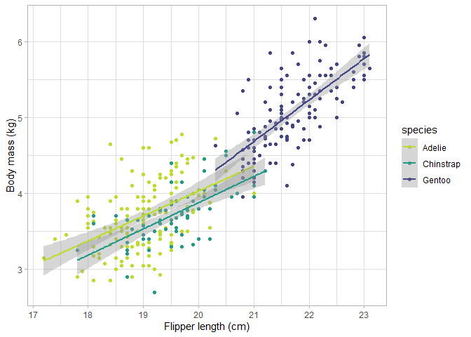

# penguin_investigations
jgh

# Penguin sizes

Let’s look at some penguin morphology courtesy of Palmer:

``` r
 #| echo: false
library(palmerpenguins)
```

    Warning: package 'palmerpenguins' was built under R version 4.3.3

``` r
library(tidyverse)
```

    Warning: package 'tidyverse' was built under R version 4.3.3

    Warning: package 'ggplot2' was built under R version 4.3.3

    Warning: package 'tibble' was built under R version 4.3.3

    Warning: package 'tidyr' was built under R version 4.3.3

    Warning: package 'readr' was built under R version 4.3.3

    Warning: package 'purrr' was built under R version 4.3.3

    Warning: package 'dplyr' was built under R version 4.3.3

    Warning: package 'stringr' was built under R version 4.3.3

    Warning: package 'forcats' was built under R version 4.3.3

    Warning: package 'lubridate' was built under R version 4.3.3

    ── Attaching core tidyverse packages ──────────────────────── tidyverse 2.0.0 ──
    ✔ dplyr     1.1.4     ✔ readr     2.1.5
    ✔ forcats   1.0.0     ✔ stringr   1.5.1
    ✔ ggplot2   3.5.0     ✔ tibble    3.2.1
    ✔ lubridate 1.9.3     ✔ tidyr     1.3.1
    ✔ purrr     1.0.2     
    ── Conflicts ────────────────────────────────────────── tidyverse_conflicts() ──
    ✖ dplyr::filter() masks stats::filter()
    ✖ dplyr::lag()    masks stats::lag()
    ℹ Use the conflicted package (<http://conflicted.r-lib.org/>) to force all conflicts to become errors

``` r
library(magrittr)
```


    Attaching package: 'magrittr'

    The following object is masked from 'package:purrr':

        set_names

    The following object is masked from 'package:tidyr':

        extract

``` r
head(penguins)
```

    # A tibble: 6 × 8
      species island    bill_length_mm bill_depth_mm flipper_length_mm body_mass_g
      <fct>   <fct>              <dbl>         <dbl>             <int>       <int>
    1 Adelie  Torgersen           39.1          18.7               181        3750
    2 Adelie  Torgersen           39.5          17.4               186        3800
    3 Adelie  Torgersen           40.3          18                 195        3250
    4 Adelie  Torgersen           NA            NA                  NA          NA
    5 Adelie  Torgersen           36.7          19.3               193        3450
    6 Adelie  Torgersen           39.3          20.6               190        3650
    # ℹ 2 more variables: sex <fct>, year <int>

Let’s look at some of the differences in body size by species, shall we?

``` r
penguins %>% group_by(species) %>%
    summarise(n = n(), mass = mean(body_mass_g, na.rm = T), se = sd(body_mass_g, na.rm = T)/sqrt(n))
```

    # A tibble: 3 × 4
      species       n  mass    se
      <fct>     <int> <dbl> <dbl>
    1 Adelie      152 3701.  37.2
    2 Chinstrap    68 3733.  46.6
    3 Gentoo      124 5076.  45.3

It looks like Adelie and Chinstrap are roughly the same size, but Gentoo
are substantially larger. Is that a function of skeletal size or are
Gentoo just chunkier? Let’s see how body mass is related to skeletal
morphometrics:

    Warning: package 'viridis' was built under R version 4.3.3

    Loading required package: viridisLite

    Warning: package 'viridisLite' was built under R version 4.3.3

    `geom_smooth()` using formula = 'y ~ x'

    Warning: Removed 2 rows containing non-finite outside the scale range
    (`stat_smooth()`).

    Warning: Removed 2 rows containing missing values or values outside the scale range
    (`geom_point()`).



The Gentoo are larger in terms of limb size as well, and maybe also have
a steeper slope of this relationship? Hard to know for sure…


    Call:
    lm(formula = body_mass_g ~ species * flipper_length_mm, data = penguins)

    Residuals:
        Min      1Q  Median      3Q     Max 
    -911.18 -251.93  -31.77  197.82 1144.81 

    Coefficients:
                                        Estimate Std. Error t value Pr(>|t|)    
    (Intercept)                        -2535.837    879.468  -2.883  0.00419 ** 
    speciesChinstrap                    -501.359   1523.459  -0.329  0.74229    
    speciesGentoo                      -4251.444   1427.332  -2.979  0.00311 ** 
    flipper_length_mm                     32.832      4.627   7.095 7.69e-12 ***
    speciesChinstrap:flipper_length_mm     1.742      7.856   0.222  0.82467    
    speciesGentoo:flipper_length_mm       21.791      6.941   3.139  0.00184 ** 
    ---
    Signif. codes:  0 '***' 0.001 '**' 0.01 '*' 0.05 '.' 0.1 ' ' 1

    Residual standard error: 370.6 on 336 degrees of freedom
      (2 observations deleted due to missingness)
    Multiple R-squared:  0.7896,    Adjusted R-squared:  0.7864 
    F-statistic: 252.2 on 5 and 336 DF,  p-value: < 2.2e-16

The interaction is significant: Adelie and Chinstrap both increase in
body size along with flipper size, but for Gentoo, this slope is steeper
(approx. 66% more g of body mass added per mm of flipper length). neat!
